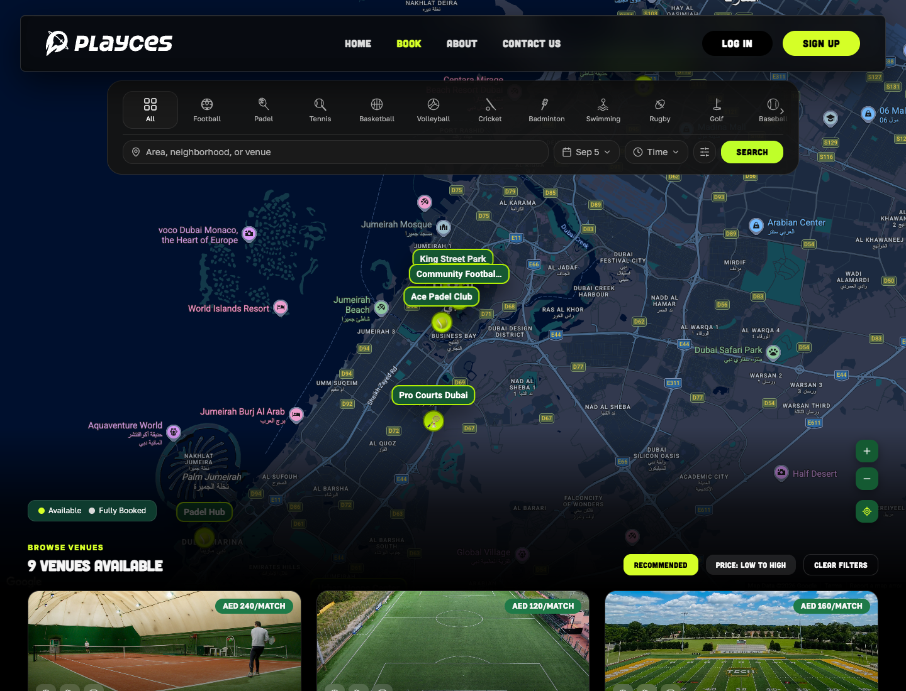
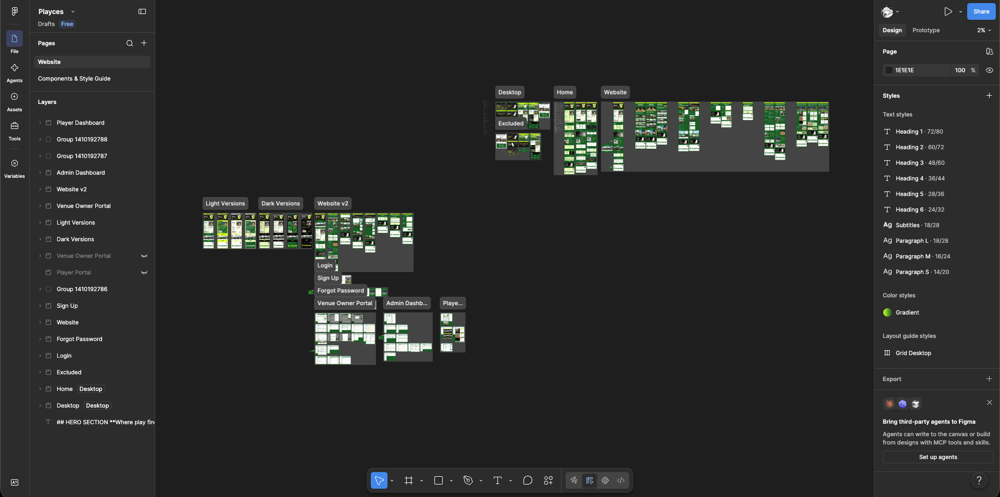
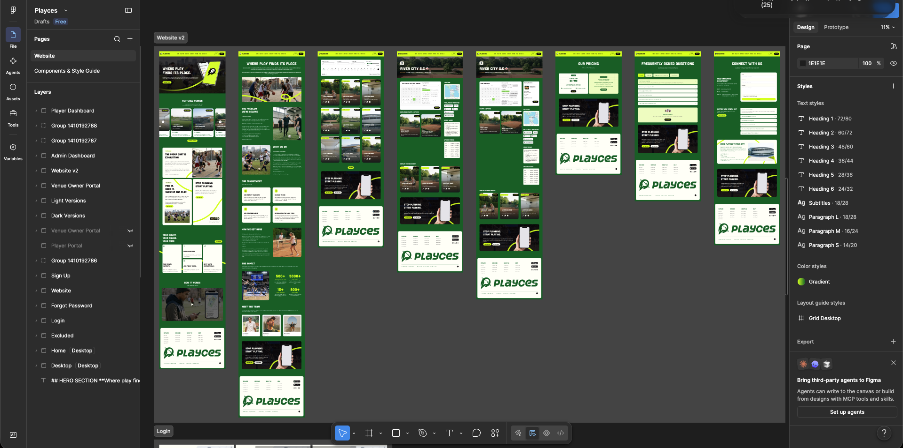
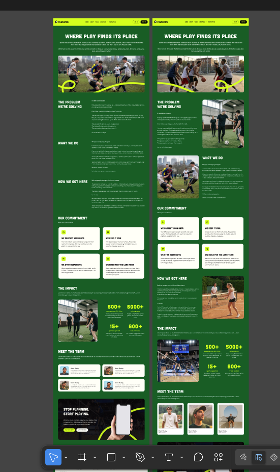
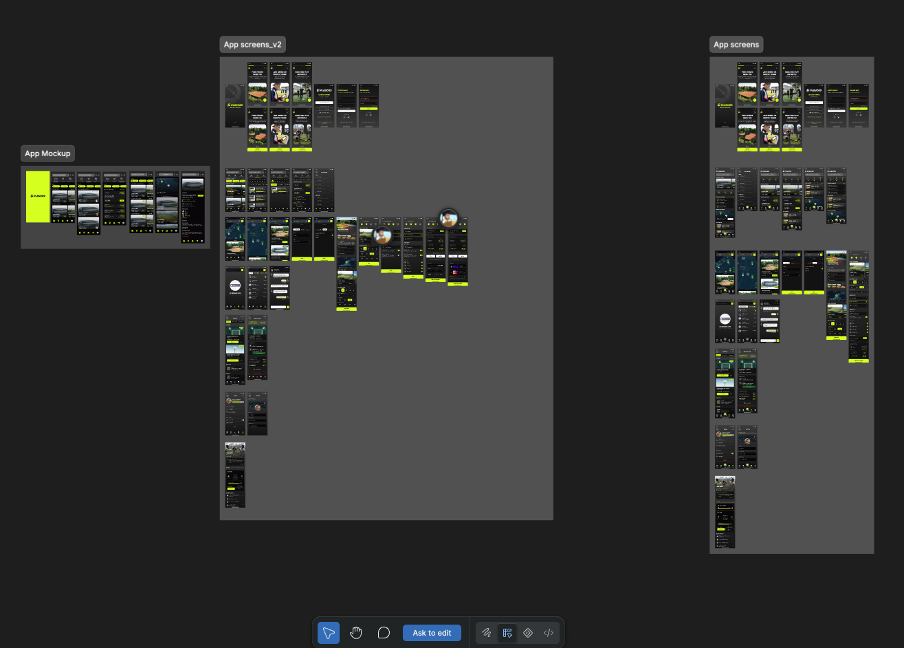
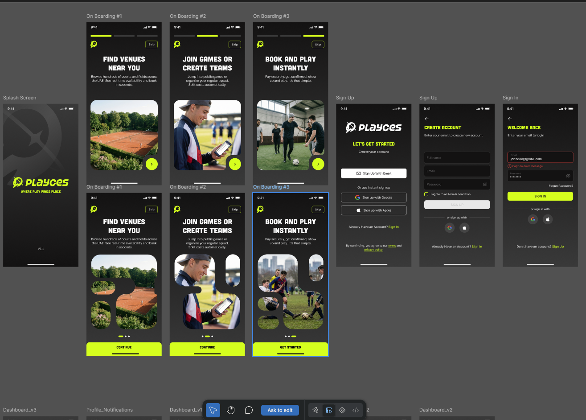
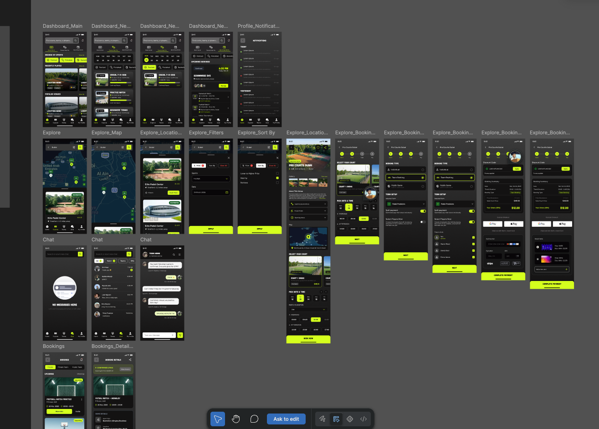
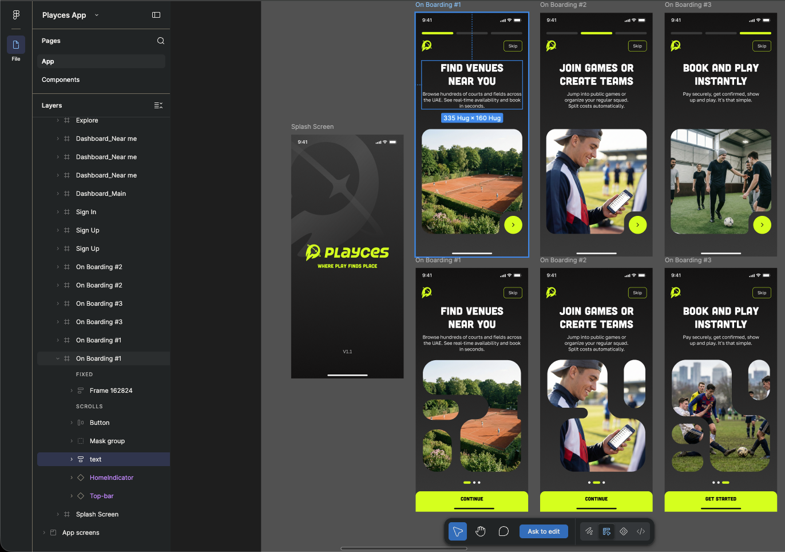

  

We're developing their website and mobile app for iOS and Android, an upcoming sports booking platform in Dubai, where people can find and book courts

  

<strong>Status: In Development</strong>

  

<strong>Note:</strong> We don't use AI to create our designs. Everything is handmade in Figma by real, breathing people. We only use AI to generate placeholder images as per client request as they don't have their own photos yet. This lets them see what the final layout will look like without using or copying other creators' copyrighted photography. The layouts, graphics, and overall design are all made by humans.

  

  

  

  

  

  

  

<!-- other-work-footer -->

Feel free to browse my other projects on my repos and website

  

